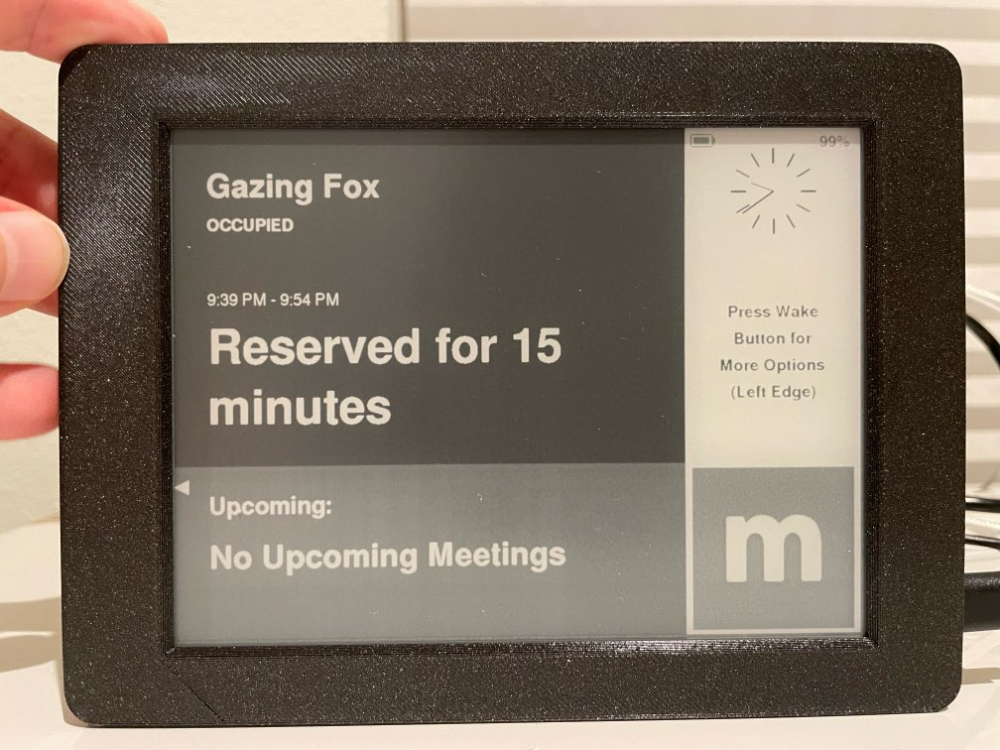
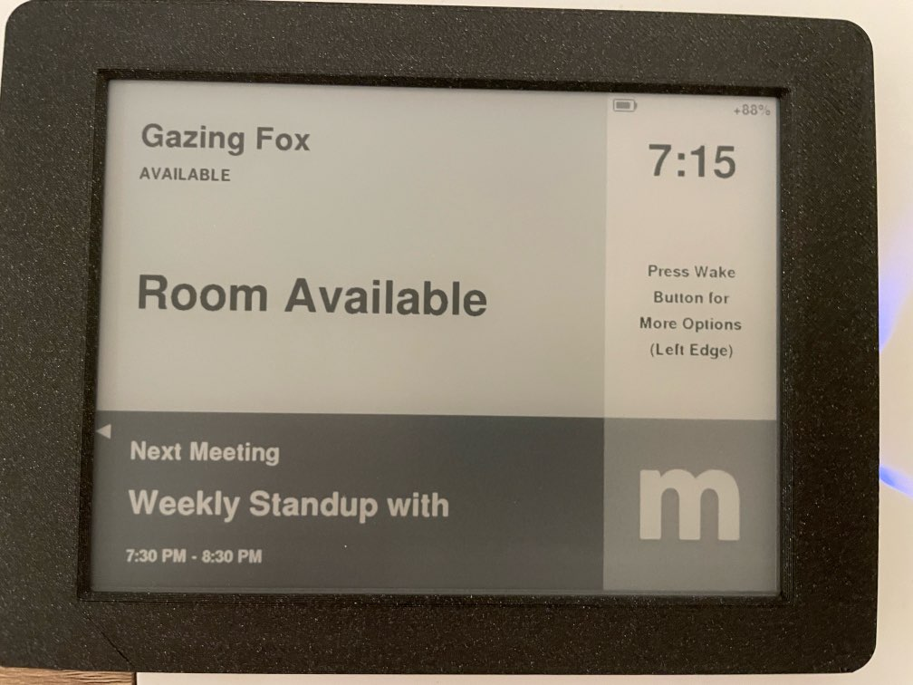
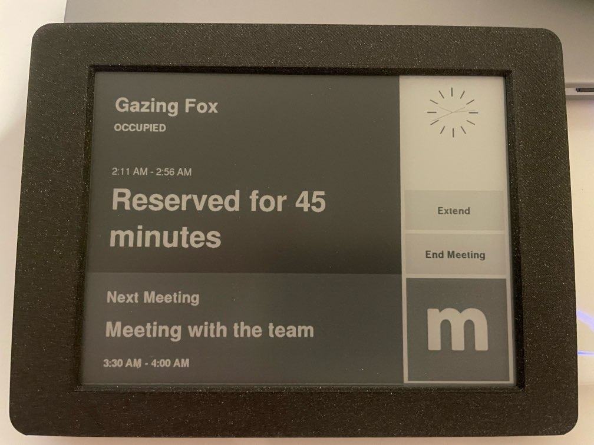

# Meeting Room 365 Inkplate Display

This repository lets you create a Meeting Room 365 display to run on the Inkplate 6 Plus E-Ink Display.

## All the Meeting Room 365 Functionality you'd expect

Packed into an open-source Inkplate display

A powerful, Wi-Fi enabled ESP32 microcontroller makes
this six-inch e-paper display – recycled from a Kindle e-reader -
incredibly easy to control. Just plug in a USB cable, open Arduino IDE,
and change the contents of the screen with few lines of code – All provided.

## Battery Life

Up to a month between charges (wake button is pressed before making a reservation), or a full week with touchscreen instantly active during business hours.

Alternatively, keep power connected to simplify operation and maintenance.

1200mAh battery provides 20 days of standby use (display updates every 10 minutes, physical button press is required before performing reservation / cancel / extend actions.

1200mAh battery provides 7-8 days of active use (display does not enter standby during business hours, refreshes more often).

Extended 2000mAh battery options are available which provide 30+ days of standby use and up to 2 weeks of active use.

## Learn more about the Inkplate 6 Plus Hardware

### See it in action:

https://www.youtube.com/watch?time_continue=65&v=eP9cfHAM7F8

### Demo of this app:

https://www.youtube.com/watch?v=zYgFCkTBbhY

## The Team behind the Hardware

https://soldered.com/about/

https://twitter.com/solderedcom

https://www.instagram.com/solderedelectronics/

https://github.com/solderedelectronics

## Purchasing Hardware

Total cost is about $220 per display for the InkPlate 6 Plus, battery, and 3d-printed enclosure. All can be purchased from the manufacturer, or separately.

https://soldered.com/product/inkplate-6plus-with-enclosure-e-paper-display-with-touchscreen-copy/

https://soldered.com/product/soldered-inkplate-6plus-with-enclosure-e-paper-display-with-touchscreen-copy/

## Getting Started with the InkPlate 6 Plus

https://www.crowdsupply.com/e-radionica/inkplate-6/updates/getting-started-with-inkplate-6-and-arduino-ide

https://github.com/SolderedElectronics/Inkplate-Arduino-library

### Setting up Inkplate 6 Using the Arduino IDE
In order to get started with Inkplate 6, follow the steps below:

1. [Install the Inkplate 6 board definition](https://github.com/e-radionicacom/Croduino-Board-Definitions-for-Arduino-IDE/blob/master/README.md) to add Inkplate 6 Plus as a board in Arduino IDE
2. [Install the CH340 drivers](https://soldered.com/learn/ch340-driver-installation-croduino-basic3-nova2/) (if you don't have them already)
3. Install the Inkplate 6 Plus Arduino library from our GitHub repository ([Guide](https://soldered.com/learn/arduino-library/#Kako%20instaliraty%20library?))
4. Your Inkplate 6 is now ready to go! Just select Tools -> Board -> Inkplate 6, choose the correct COM port, and upload your code, cloned from the linked repository

## Building and Deploying the Meeting Room 365 app to the InkPlate 6 Plus

1. Clone or [Download](https://github.com/kidGodzilla/mr365-inkplate-display/archive/refs/heads/main.zip) the linked [GitHub Repository](https://github.com/kidGodzilla/mr365-inkplate-display), and open it in Arduino IDE
2. Modify variables in the top portion of [Inkplate_mr365.ino](https://github.com/kidGodzilla/mr365-inkplate-display/blob/main/inkplate-6plus/Inkplate_mr365.ino). You will need to add your SSID, Wifi Password, and Display Key, at minimum.
3. Ensure the correct board is selected under the "Tools" tab.
4. **Install libraries:**
   In Arduino IDE, just go to the Library manager and install these:
    * inkplatelibrary
    * eztime
    * arduinojson
5. Click "Upload" under the "Sketch" tab.

It should now compile for Inkplate 6PLUS, 6PLUSV2, 6FLICK

## Photos

The room is occupied, and the display is in standby. Using the analog clock option.

The room is available, and the display is in standby. This uses the digital clock option.

The room is occupied, and active. Three actions are available based on the room state: Grab Room, Extend, or End Meeting.
